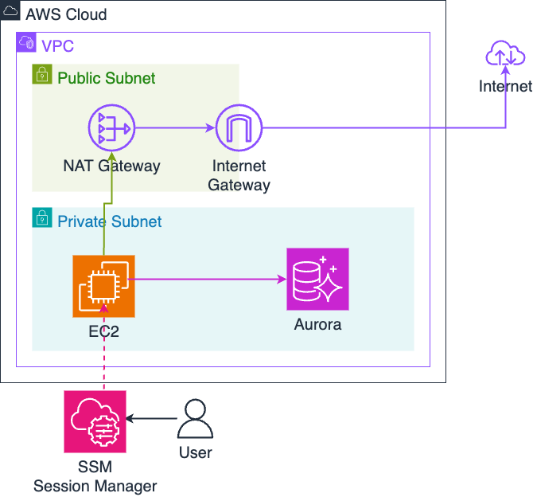

## 本リポジトリの使い方

PostgreSQL での UPDATE 実行について、以下のケースで簡単にベンチマークできる環境を作成しました。

- update 文実行方法
  - ORM ([bob](https://github.com/stephenafamo/bob)) を使用した場合の実行時間
  - 生の SQL を実行した場合の実行時間
- 実行環境
  - ローカル
  - aws 上

各ケースで、以下の実行時間を 5 回分計測し、結果を csv に出力します。

- `SELECT 1` を 10000 回実行する
- トランザクションを張らずに 1 万回 UPDATE する
- トランザクションを張って 1 万回 UPDATE する
- bulk UPDATE で、1 発だけ UPDATE する

## 検証環境のセットアップ

### ローカル環境検証

#### DB 立ち上げ

```bash
docker compose up -d # PostgreSQL を立ち上げる
make seed-db-local # テーブル作成
```

#### Go, uv (Python) 環境用意

(skip)

#### env ファイル配置

以下の env ファイルを、`psql_update` 直下に配置してください。

```bash
DB_HOST=localhost
DB_PORT=15432
DB_USER=postgres
DB_PASSWORD=postgres
DB_NAME=app_db
```

### AWS 上に環境を構築する

以下のような環境を作成します。



#### 1. Terraform で環境を構築

```bash
cd terraform
terraform init
terraform apply
```

EC2 インスタンス上には `user_data.sh` により、Go/Python(uv) 環境およびリポジトリのクローンが自動でセットアップされます。

#### 2. EC2 にログイン

SSM Session Manager を使用してログインします。
EC2 上では、 `ec2-user` にユーザを切り替えて作業を行ってください。

```bash

# SSM でログイン
aws ssm start-session --target $INSTANCE_ID
$ sudo su - ec2-user
```

#### 3. Aurora への接続設定

EC2 上で `.env` ファイルを作成します。

```bash
cd ~/psql_update

# Aurora のエンドポイントを取得（ローカルPCで実行）
aws rds describe-db-clusters \
  --db-cluster-identifier psql-update-aurora-cluster \
  --query 'DBClusters[0].Endpoint' \
  --output text

# Aurora のパスワードを取得（ローカルPCで実行）
./scripts/get_aurora_password.sh
```

取得した情報を元に、EC2 上で以下のような `.env` ファイルを作成してください。

```bash
DB_HOST=aurora.local
DB_PORT=5432
DB_USER=postgres
DB_PASSWORD=<取得したパスワード>
DB_NAME=app_db
```

#### 4. DB の初期化

```bash
cd ~/psql_update
make seed-db-ec2
```

#### 5. 環境の削除

基本的には terraform destroy でまとめて削除できます。

```bash
cd terraform
terraform destroy
```

secrets manager に保管した aurora のパスワードは手動で削除してください。

## 検証方法

### 生の SQL

```bash
uv run scripts/benchmark_sql.py
```

実行される具体的な SQL については、 `sql` 下を確認してください。

`output/raw_sql_benchmark_results_<スクリプト実施時刻>.csv` に結果が出力されます。

### ORM

```bash
go run . benchmark
```

`output/go_sql_benchmark_results_<スクリプト実施時刻>.csv` に結果が出力されます。
